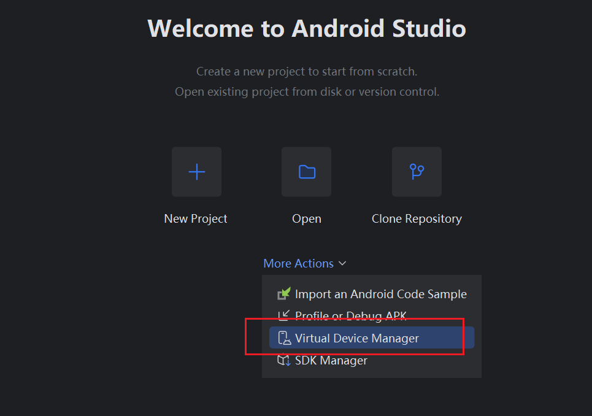
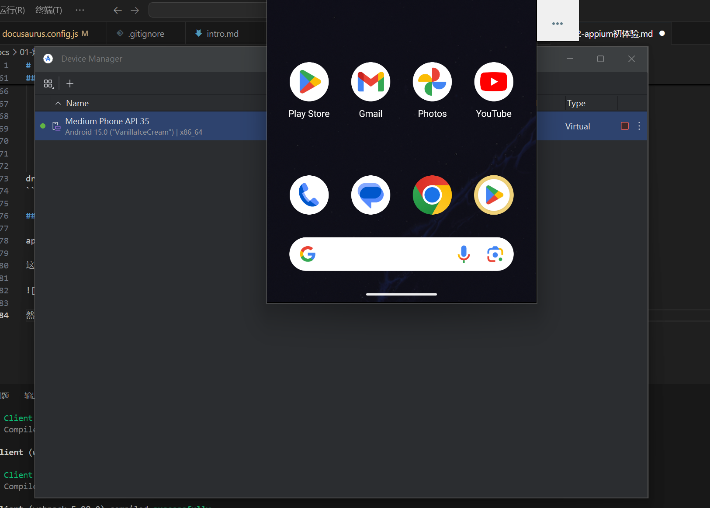
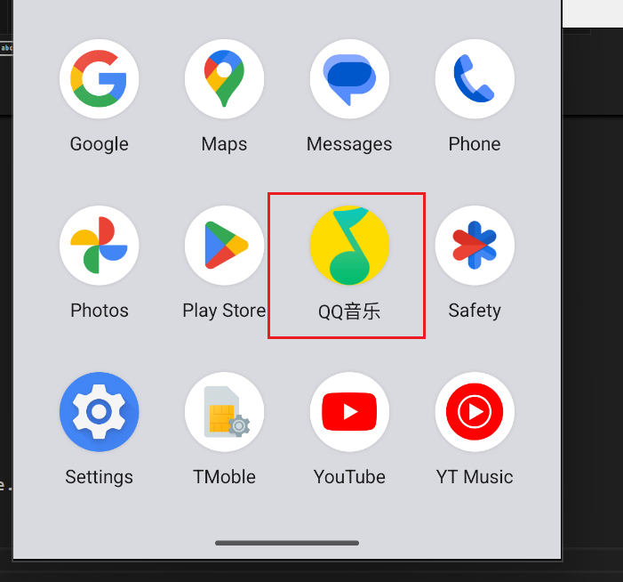
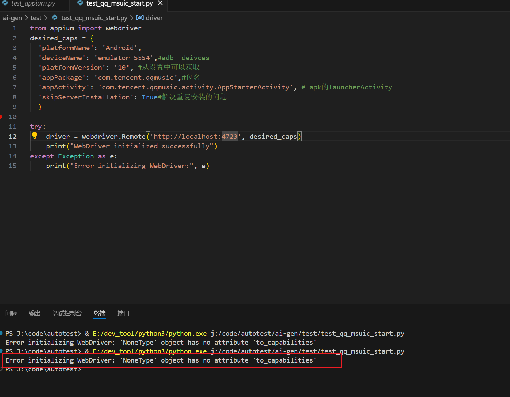

# appium模拟打开app

使用python来模拟打开一个app，然后进行操作。

## 环境搭建

需要先下载appium的python客户端，然后再启动appium的server。

```shell
pip install appium-python-client
```

```cmd
appium
```

到这里初始环境就准备好了。

## 准备app

到apkure上面下载一个qq音乐，保存到本地。

下载的app名为QQMusic_14.2.0.8_APKPure.apk。

准备好app后，需要获取包的名字和activity。appium是通过包名和activity来定位app的。

可以使用aapt命令来获取包名和activity。

```cmd
aapt dump badging QQMusic_14.2.0.8_APKPure.apk
```

得到的主要结果为：

```cmd
package: name='com.tencent.qqmusic' versionCode='6158' versionName='14.2.0.8' platformBuildVersionName='12' platformBuildVersionCode='32' compileSdkVersion='32' compileSdkVersionCodename='12'
install-location:'auto'
sdkVersion:'23'
targetSdkVersion:'30'

application-label:'QQ音乐'
application-label-zh:'QQ音乐'
application-label-zh-CN:'QQ音乐'
application-icon-120:'r/s/e.webp'
application-icon-160:'r/s/e.webp'
application-icon-240:'r/s/e.webp'
application-icon-320:'r/s/e.webp'
application-icon-480:'r/g/e.webp'
application-icon-640:'r/g/e.webp'
application-icon-65534:'r/s/e.webp'
application-icon-65535:'r/g/e.webp'
application: label='QQ音乐' icon='r/s/e.webp'
uses-library-not-required:'org.apache.http.legacy'
launchable-activity: name='com.tencent.qqmusic.activity.AppStarterActivity'  label='' icon=''
uses-library-not-required:'androidx.window.extensions'
uses-library-not-required:'androidx.window.sidecar'
```

从结果可以看到包名为`com.tencent.qqmusic`，activity为`com.tencent.qqmusic.activity.AppStarterActivity`。

## 编写测试代码

```python
import unittest
from appium import webdriver
from appium.options.android import UiAutomator2Options
from appium.webdriver.common.appiumby import AppiumBy

capabilities = dict(
    platformName='Android',
    automationName='uiautomator2',
    deviceName='emulator-5554',
    appPackage='com.tencent.qqmusic',
    appActivity='com.tencent.qqmusic.activity.AppStarterActivity',
    language='en',
    locale='US'
)

appium_server_url = 'http://localhost:4723'

class TestAppium(unittest.TestCase):
    def setUp(self) -> None:
        self.driver = webdriver.Remote(appium_server_url, options=UiAutomator2Options().load_capabilities(capabilities))

    def tearDown(self) -> None:
        if self.driver:
            self.driver.quit()

    def test_find_battery(self) -> None:
        return

if __name__ == '__main__':
    unittest.main()
```

## 模拟安卓设备

app需要安装在安卓设备上才能对其进行测试，可以使用模拟器或者真机。

这里用Android studio来创建一个模拟器。



启动后的内容如下：



然后使用adb命令来连接模拟器。

```cmd 
PS C:\Users\growd> adb devices
List of devices attached
emulator-5554   device
```

连接模拟器并上传app到模拟器进行安装。

```cmd
PS E:\apk> adb install QQMusic_14.2.0.8_APKPure.apk
Performing Streamed Install
Success
```

可以看到模拟器中已经安装了app。



## 调试代码

发现报错，经确认使少了驱动，需要进行安装。



各个驱动的信息如下：

<table data-start="137" data-end="580"><thead data-start="137" data-end="160"><tr data-start="137" data-end="160"><th data-start="137" data-end="142">驱动</th><th data-start="142" data-end="147">用途</th><th data-start="147" data-end="154">适用范围</th><th data-start="154" data-end="160">备注</th></tr></thead><tbody data-start="194" data-end="580"><tr data-start="194" data-end="301"><td><code data-start="196" data-end="210">uiautomator2</code></td><td>使用 Android 官方 <code data-start="227" data-end="241">UiAutomator2</code> 框架进行 UI 自动化测试</td><td><strong data-start="258" data-end="277">Android 5.0 及以上</strong></td><td><strong data-start="280" data-end="286">推荐</strong>，官方维护，支持大部分功能</td></tr><tr data-start="302" data-end="385"><td><code data-start="304" data-end="314">espresso</code></td><td>使用 Google <code data-start="327" data-end="337">Espresso</code> 框架进行 UI 测试</td><td><strong data-start="351" data-end="370">Android 4.3 及以上</strong></td><td>更快，适用于黑盒测试</td></tr><tr data-start="386" data-end="473"><td><code data-start="388" data-end="400">selendroid</code></td><td>早期基于 <code data-start="408" data-end="425">Instrumentation</code> 进行 UI 测试</td><td><strong data-start="437" data-end="458">Android 2.3 - 4.4</strong></td><td><strong data-start="461" data-end="471">过时，不推荐</strong></td></tr><tr data-start="474" data-end="580"><td><code data-start="476" data-end="481">atd</code> (Android Test Distribution)</td><td>基于 <code data-start="515" data-end="535">AndroidJUnitRunner</code> 进行分布式测试</td><td><strong data-start="546" data-end="565">Android 5.0 及以上</strong></td><td>适用于大规模并行测试</td></tr></tbody></table>

```cmd
PS E:\apk> appium driver list
✔ Listing available drivers
- uiautomator2 [not installed]
- xcuitest [not installed]
- espresso [not installed]
- mac2 [not installed]
- windows [not installed]
- safari [not installed]
- gecko [not installed]
- chromium [not installed]
```

驱动下载完成后显示内容如下：

```cmd
PS E:\apk> appium driver install uiautomator2
✔ Checking if 'appium-uiautomator2-driver' is compatible
✔ Installing 'uiautomator2'
ℹ Driver uiautomator2@4.1.0 successfully installed
- automationName: UiAutomator2
- platformNames: ["Android"]
PS E:\apk> appium driver list
✔ Listing available drivers
- uiautomator2@4.1.0 [installed (npm)]
- xcuitest [not installed]
- espresso [not installed]
- mac2 [not installed]
- windows [not installed]
- safari [not installed]
- gecko [not installed]
- chromium [not installed]
PS E:\apk>
```

下载完成后重启appium。